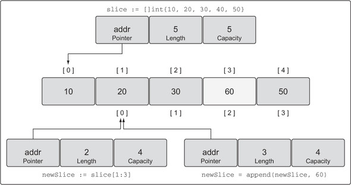
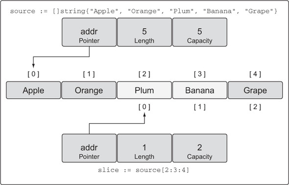

# Slices

Slices - dynamic arrays that can shrink and grow

### Make and slice literals

```go
// Create a slice of strings.
// Contains a length and capacity of 5 elements.
slice := make([]string, 5)
```

```go
// Create a slice of integers.
// Contains a length of 3 and has a capacity of 5 elements.
slice := make([]int, 3, 5)
```


```go
// Create a slice of integers.
// Make the length larger than the capacity.
slice := make([]int, 5, 3)

Compiler Error:
len larger than cap in make([]int)
```

```go
// Create a slice of strings.
// Contains a length and capacity of 5 elements.
slice := []string{"Red", "Blue", "Green", "Yellow", "Pink"}

// Create a slice of integers.
// Contains a length and capacity of 3 elements.
slice := []int{10, 20, 30}
```

```go
// Create a slice of strings.
// Initialize the 100th element with an empty string.
slice := []string{99: "99"}
```

Notice, if you specify a value inside the [ ] operator, you’re creating an array. If you don’t specify a value, you’re
creating a slice.

```go
// Create an array of three integers.
array := [3]int{10, 20, 30}

// Create a slice of integers with a length and capacity of three.
slice := []int{10, 20, 30}
```

Declaring a nil slice

```go
// Create a nil slice of integers.
var slice []int

```

A nil slice is the most common way you create slices in Go. They can be used with many of the standard library and
built-in functions that work with slices. They’re useful when you want to represent a slice that doesn’t exist, such as
when an exception occurs in a function that returns a slice


```go
// Use make to create an empty slice of integers.
slice := make([]int, 0)

// Use a slice literal to create an empty slice of integers.
slice := []int{}
```

An empty slice contains a zero-element underlying array that allocates no storage. Empty slices are useful when you want
to represent an empty collection, such as when a database query returns zero results


## Working with slices

Declaring an array using an array literal

```go
// Create a slice of integers.
// Contains a length and capacity of 5 elements.
slice := []int{10, 20, 30, 40, 50}

// Change the value of index 1.
slice[1] = 25
```

Taking the slice of a slice

```go
// Create a slice of integers.
// Contains a length and capacity of 5 elements.
slice := []int{10, 20, 30, 40, 50}


// Create a new slice.
// Contains a length of 2 and capacity of 4 elements.
newSlice := slice[1:3]
```


Calculating the length and capacity for any new slice is performed using the following formula.

```go
For slice[i:j] with an underlying array of capacity k

Length:   j - i
Capacity: k - i
```

making changes to a slice

```go
// Create a slice of integers.
// Contains a length and capacity of 5 elements.
slice := []int{10, 20, 30, 40, 50}

// Create a new slice.
// Contains a length of 2 and capacity of 4 elements.
newSlice := slice[1:3]

// Change index 1 of newSlice.
// Change index 2 of the original slice.
newSlice[1] = 35
```


Runtime error showing index out of range

```go
// Create a slice of integers.
// Contains a length and capacity of 5 elements.
slice := []int{10, 20, 30, 40, 50}

// Create a new slice.
// Contains a length of 2 and capacity of 4 elements.
newSlice := slice[1:3]

// Change index 3 of newSlice.
// This element does not exist for newSlice.
newSlice[3] = 45

Runtime Exception:
panic: runtime error: index out of range
```

Using append to add an element to a slice

```go
// Create a slice of integers.
// Contains a length and capacity of 5 elements.
slice := []int{10, 20, 30, 40, 50}

// Create a new slice.
// Contains a length of 2 and capacity of 4 elements.
newSlice := slice[1:3]

// Allocate a new element from capacity.
// Assign the value of 60 to the new element.
newSlice = append(newSlice, 60)
```



```go
// Create a slice of integers.
// Contains a length and capacity of 4 elements.
slice := []int{10, 20, 30, 40}

// Append a new value to the slice.
// Assign the value of 50 to the new element.
newSlice := append(slice, 50)
```

Using append to increase the length and capacity of a slice

```go
// Create a slice of integers.
// Contains a length and capacity of 4 elements.
slice := []int{10, 20, 30, 40}

// Append a new value to the slice.
// Assign the value of 50 to the new element.
newSlice := append(slice, 50)
```


## Three index slices

Declaring a slice of string using a slice literal

```go
// Create a slice of strings.
// Contains a length and capacity of 5 elements.
source := []string{"Apple", "Orange", "Plum", "Banana", "Grape"}
```


Performing a three-index slice

```go
// Slice the third element and restrict the capacity.
// Contains a length of 1 element and capacity of 2 elements.
slice := source[2:3:4]
```

A representation of the new slice after the operation


How length and capacity are calculated

```
For slice[i:j:k]  or  [2:3:4]

Length:   j - i  or  3 - 2 = 1
Capacity: k - i  or  4 - 2 = 2
```
