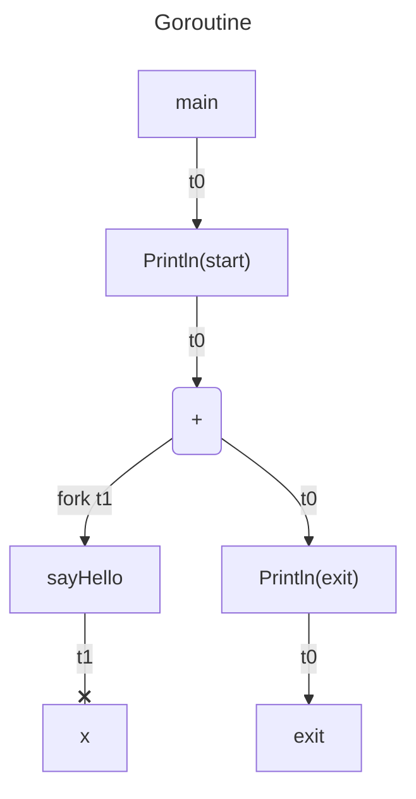
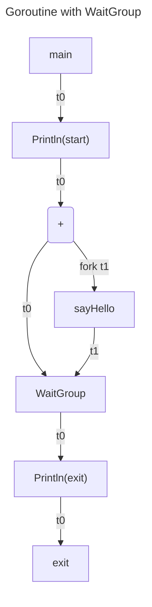

## Goroutines

A goroutine is a lightweight execution thread in the Go programming language and a function that executes concurrently
with the rest of the program. Goroutines are incredibly cheap when compared to traditional threads as the overhead of
creating a goroutine is very low

sayHello() function never finish before main goroutine completes.

```go
func main() {
	fmt.Println("Start")
	go sayHello()
	fmt.Println("Exit")
}

func sayHello() {
    fmt.Println("Hello world goroutine")
}
```



anonymous function syntax

```go
func main() {
	msg := "Hello";
	go func(msg string) {
        fmt.Println(msg)
	}(msg)
	
}
```

Add a sleep function to yield sayHello function sometimes to finish before exit out the main goroutine. However, this
practice should be avoided at all time because goroutine execution time is non-deterministic.

```go
func main() {
    msg := "Hello";
    go func(msg string) {
        fmt.Println(msg)
    }(msg)
	
	time.Sleep(100 * time.Millisecond)
}
```

## WaitGroup

sync.WaitGroup() - awaiting all goroutines to complete.

```go
var wg = sync.WaitGroup()

func main() {
    msg := "Hello";
	wg.Add(1)
	
    go func(msg string) {
		defer wg.Done()
        fmt.Println(msg)
    }(msg)
	
	wg.Wait()
}
```



What happen if wg.Done is not invoked? It will be a fatal error with message = all routines are sleep - deadlock.

```go
func main() {
    msg := "Hello";
	wg.Add(1)
	
    go func(msg string) {
        fmt.Println(msg)
    }(msg)
	
	msg = "goodbye"
	wg.Wait()
}
```

An example has two goroutines running within the for loop

```go
var (
    wg      = sync.WaitGroup{}
    counter = 0
)

func main() {
    // https://rxmarbles.com/
    for i := 0; i < 10; i++ {
		wg.Add(2)
        go sayHello()
        go imcrement()
    }

    wg.Wait()
}

func sayHello() {
    defer wg.Done()
    fmt.Printf("Hello #%v\n", counter)
}

func imcrement() {
    counter++
    wg.Done()
}
```

## Mutex

Mutex is one of the mechanisms to access a variable at a time to avoid conflicts. It has two methods: Lock and
Unlock. But wait, this approach destroys the concurrency. We're better off not applying the goroutine to gain two
aspects: simplicity and performance.

```go
var (
	wg      = sync.WaitGroup{}
	counter = 0
	mu      = sync.RWMutex{}
)

func main() {
	//runtime.GOMAXPROCS(100)
	// https://rxmarbles.com/
	for i := 0; i < 10; i++ {
		wg.Add(2)
		mu.RLock()
		go sayHello()
		mu.Lock()
		go imcrement()
	}

	wg.Wait()
}

func sayHello() {
	defer wg.Done()
	fmt.Printf("Hello #%v\n", counter)
	mu.RUnlock()
}

func imcrement() {
	counter++
	mu.Unlock()
	wg.Done()
}

```

## GOMAXPROCS

GOMAXPROCS - assign number of threads. By default, it would assign to the max number of threads available to cpu core.

```go
func main() {
	runtime.GOMAXPROOCS(1)
	fmt.Printf("Threads: %v\n", runtime.GOMAXPROCS(-1))
}
```

## go run -race

go run -race goroutines.go <p/>
the -race helps to track the race condition in the code very quickly


