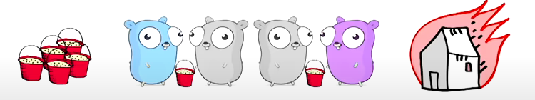
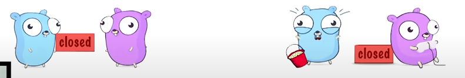
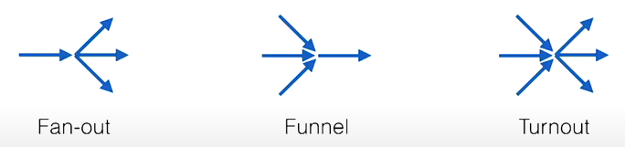

# Currency Patterns

What is Concurrency?

* Concurrency is the composition of independently executing computations.
* Concurrency is a way to structure software, particularly as a way to write clean code that interacts well with the
  real world.
* Concurrency is not parallelism. It is about the design.

parallelism is the property of a system where several computations can execute simultaneously.

Concurrency is not parallelism
* _**Design**_ your program as a collection of independent processes
* **_Design_** these processes to eventually run in parallel
* **_Design_** your code so that the outcome is always the same

A semaphore is a variable or abstract data type used to control access to a common resource by multiple threads and
avoid critical section problems in a concurrent system such as a multitasking operating system.

Concurrency in Detail

* group code (and data) by identifying independent tasks
* no race conditions - leads to unpredictable outcomes
* no deadlock - leads to no outcome
* more worker = faster execution: scalability

Communicating Sequential Processes (CSP)

* Tony Hoare, 1978

1. Each process is built for sequential execution
2. Data is communicated between processes via channels. No shared state!
3. Scale by adding more of the same

Go's Concurrency Toolset

* go routine
* channels
* select
* sync package

Channels

* Think of a bucket chain
* 3 components: sender, buffer, receiver
* The buffer is optional



unbuffered channel is blocked when no data sent or received

Blocking breaks concurrency

* Remember?
    * no deadlock?
    * more workers = faster execution
* Blocking can lead to deadlock
* Blocking can prevent scaling

Closing channels

* Close sends a special "closed" message
* The receiver will at some point see "closed". Yay! nothing to do
* if you try to send more. panic!



## Closing Channels

```go
package somepackage

import "fmt"

func someFunc() {
  c := make(chan int)
  close(c)

  fmt.Println(<-c)
}

// what is printed?

// 0, false

// a receiver always returns two values
// 0 as it is the zero value of int
// false because, "no more data or "returned value is not valid"

// suggest that always close the channel from sending side.
```

### Select

* like a switch statement on channel operations
* The order of cases doesn't matter at all
* There is a default case, too
* The first not-blocking case is chosen (send and/or receive)

```go
package main

import (
  "fmt"
  "sync"
)

func main() {
  var count int
  var lock sync.Mutex
  
  increment := func() {
    lock.Lock()
    defer lock.Unlock()
    count++
    fmt.Printf("Incrementing: %d\n", count)
  }

  decrement := func() {
    lock.Lock()
    defer lock.Unlock()
    count--
    fmt.Printf("Decrementing: %d\n", count)
  }

  // Increment
  var arithmetic sync.WaitGroup
  for i := 0; i <= 5; i++ {
    arithmetic.Add(1)
    go func() {
      defer arithmetic.Done()
      increment()
    }()
  }

  // Decrement
  for i := 0; i <= 5; i++ {
    arithmetic.Add(1)
    go func() {
      defer arithmetic.Done()
      decrement()
    }()
  }
  arithmetic.Wait()
  fmt.Println("Arithmetic complete.")
}
```

Making channels non-blocking

```go
package somepackage

import "time"

func TryReceiveWithTimeout(c <- chan int, duration time.Duration) (data int, more, ok bool) {
	select {
	case data, more = <-c:
          return data, more, true
	default:                        // processed when c is blocking
          return 0, true, false
    }
}
```

Shape your data flow

* Channels are streams of data
* Dealing with multiple streams is the true of select



Fan-out

```go
func Fanout(In <- chan int, OutA, OutB chan int) {  // Receive until closed
	for data := range In {
		select: {               // Send to the first non-blocking channel
		case OutA <- data:
		case OutB <- data:
        }
    }
}


```

Turnout

```go
package somepackage

func Turnout(InA, InB <- chan int, OutA, OutB chan int) {
    // variable declaration left out for readability
	var data int
	var more bool
	
    for {
      select {                    // Receive from first non-blocking
      case data, more = <-InA:
      case data, more = <-InB:
      }
      if !more {
        return
      }
      select {                     // Send to the first non-blocking
      case OutA <-data:
      case OutB <-data:
      }
    }
}   
```

Turnout with Quit

```go
func Turnout(Quit <- chan int, InA, InB <- chan int, OutA, OutB chan int) {
    // variable declaration left out for readability
    for {
      select {                    // Receive from first non-blocking
      case data, more = <-InA:
      case data, more = <-InB:
      
      case <- Quit:             // remember: close generates a message
        close(InA)              // Actually this is an anti-pattern
        close(inB)              // but you can argue that quit acts as a delegate
        
        Fanout(InA, OutA, OutB)     // flush the remaining data
        Fanout(InB, OutA, OutB)
        return
      }
    }
}   
```

### Where Channels Fail

* you can create deadlock with channels
* Channels pass around copies, which can impact performance
* Passing pointers to channels can create race conditions
* What about "naturally shared" structures like caches or registries?

### Mutexes are not an optimal solution

* Mutexes are like toilets - the longer you occupy them, the longer the queue gets
* Read/write mutexes can only reduce the problem
* Using multiple mutexes will cause deadlocks sooner or later
* All-in-all not the solution we're looking for

### Three shades of code

* Blocking = your program may get locked up (for undefined time)
* Lock free = At least one part of your program is always making progress
* Wait free = All parts of your programs are always making progress

### Atomic operations

* sync.atomic package
* Store, Load, Add, Swap and CompareAndSwap
* Mapped to thread-safe CPU instructions
* These instructions only work on integer types
* Only about 10-60x slower than their non-atomic counterparts

### Spinning CAS

* you need a state variable and a "free" constant
* use CAS (CompareAndSwap) in a loop:
    * if state is not free: try again until it is
    * if state is free, set it to something else
* if you managed to change the state, you "own" it

### Ticket Storage

* We need to indexed data structure, a ticket and a done variable
* A function draws a new ticket by adding 1 to the ticket
* Evey ticket number is unique as we never decrement
* Treat the ticket as an index to store your data
* Increase done to extend the "ready to read" range

```go
type TicketStore struct {
  ticket *uint64
  done   *uint64
  slots  []string // for simplicity: imagine this to be infinite
}

func (ts *TicketStore) Put(s string) {
    t := atomic.AddUint64(ts.ticket, 1) - 1 // draw a ticket
    ts.slots[t] = s                            // store your data
    
    for !atomic.CompareAndSwapUint64(ts.done, t, t+1) {
    runtime.Gosched()
    }
}

func (ts *TicketStore) GetDone() []string {
    return ts.slots[:atomic.LoadUint64(ts.done) + 1]			//read up to done
}
```

### Debugging non-blocking code

* I call it "the instruction pointer game"
* The rules:
    * Pull up two windows (= two go routines) with the same code
    * you have one instruction pointer that iterates through your code
    * You may switch windows at any instruction
    * Watch your variables for race conditions

### Guidelines for non-blocking code

* Don't switch between atomic and non-atomic functions
* Target and exploit situations which enforce uniqueness
* Avoid changing two things at a time
    * Sometimes you can exploit bit operations
    * Sometimes intelligent ordering can do the trick
    * Sometimes it's just not possible at all

### Concurrency in practice

* Avoid blocking, avoid race conditions
* Use channels to avoid shared state. Use select to manage channels
* Where channels don't work:
    * Try to use tools from the sync package first
    * In simple cases or when really needed: try lockless code

### Ticket storage

## for-select loop

## done channel

## pipeline