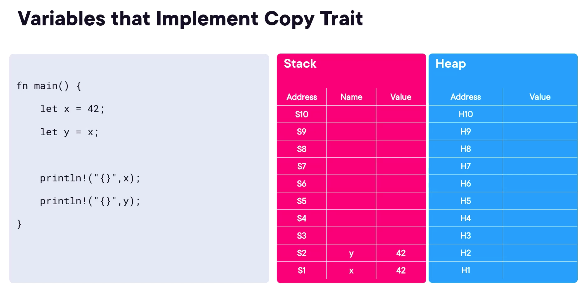
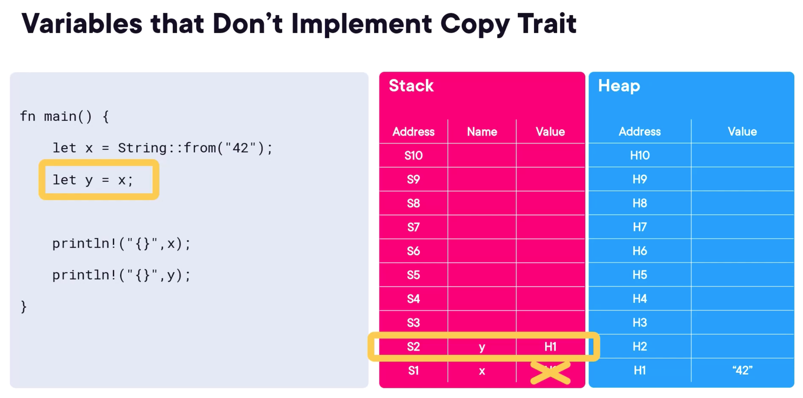

# Ownership & Borrowing

Three models of memory management, manual, garbage collection, and ownership & borrowing.

| Memory Management Model | Language     |
|-------------------------|--------------|
| Manual                  | C++          |
| Garbage Collection      | Go, Java, C# |
| Ownership & Borrowing   | Rust         |

## Comparison: Memory Management Models


## Memory Unsafe

* Segmentation faults
* Buffer overruns
* Dangling pointers
* Double-frees

## Garbage Collection

* Does solve the memory

## Borrowing

* local scope
* static global scope
* static mutable variable
* Strings in Rust
* copying vs. moving
* cloning

------
Memory management in Rust is different to most other languages<br/>
Need to consider:

* what is the scope of a variable
* why is memory allocated? heap or stack
* what does ownership mean in Rust

When you define a variable in a function:

* the variable has local scope
* the variable goes out of scope at the closing '}'
* variable memory allocated in the stack or heap depends on fixed or variable size

- Variables with a known, fixed size will be allocated on the stack.
- Variables with an unknown size at compile time or a size that might change must be allocated on the heap.

Languages with Garbage Collectors e.g. Java, Go, C#, will often abstract away complexities of the Stack and the Heap.


Ownership is a set of rules that govern how a Rust program manages memory. It helps ensure the memory safety of your
program without a garbage collector.,p/>

### Rules of Ownership

* Each value in Rust has a variable called its owner.
* There can only be one owner at a time.
* When the owner goes out of scope, the value will be dropped.
  The two pillars of Rust are Speed and Safety. Rust has a borrower checker to enforce these rules at compile time.

When you define a variable in a block

* the variable has block scope
* the variable goes out of scope at the closing '}'

### Copyable Data Types

* primitive types (scalar & compound)
* known, fixed-size types at compile time
* stored on the stack
* implement the Copy trait

### Copy Trait

Primitive types implement the Copy trait.
When you assign a value to another variable, it bit-copies the value.
The original variable is still valid.


### Move Semantics

Other types don't implement the Copy trait.
When you assign a value to another variable, it moves the value.


Possible to allocate memory elsewhere in Rust:

* static storage
* heap-based storage

```rust
pub fn do_it() {
    println!("\nIn demo_locals::do_it()");

    let x = 42; // local scope

    if x != 0 {
        let s1 = "Andy";  // black scope
        println!("s1: {}", s1);
    }

    // Nope:
    // println!("s1 {}", s1); // compile error because s1 is out of scope
}
```

## static local scope

* a static variable is allocated permanently
* it exists until the program terminates

you can define static variables:

* Locally, inside a function
* Globally, outside a function

````rust
use once_cell::sync::Lazy;
// Defined in the once_cell crate.
use chrono::{DateTime, Utc}; // Defined in the chrono crate. 

use std::thread::sleep;
use std::time::Duration;

pub fn do_it() {
    println!("\nIn demo_static_local::do_it()");

    static_init_at_compile_time();
    static_init_at_run_time();
}

fn static_init_at_compile_time() {
    static MESSAGE: &str = "Croeso o Gymru 😃";
    println!("MESSAGE: {}", MESSAGE);
}

fn static_init_at_run_time() {

    // This statement won't work. 
    // You can't initialize a static directly with a run-time value (it's not thread-safe).
    // static TIMESTAMP_WONT_WORK: DateTime<Utc> = Utc::now();

    println!("Curr time: {}", Utc::now().format("%T"));

    static TIMESTAMP: Lazy<DateTime<Utc>> = Lazy::new(|| {
        sleep(Duration::new(5, 0));
        let now = Utc::now();
        println!("Curr time: {}", now.format("%T"));
        return now;
    });
    println!("TIMESTAMP: {}", (*TIMESTAMP).format("%T"));
}
````

### Copy vs Clone

In Rust, bit-wise copying can copy only primitive types or struct containing primitive types.
The variables are unknown & not-fixed size can be cloned, and clone() is a method that creates a deep copy of the data.

For example, the Person struct can be cloned, because it contains String, which is a heap-allocated type.

```rust
#[derive(Clone)]
struct Person {
    name: String,
    age: u8,
}
```

For example the Person struct can be copied, because it contains only primitive types.

```rust
#[derive(Copy, Clone)]
struct Person {
    id: u32,
    age: u8,
}
```

### String Handler

```rust
pub fn do_it() {
    println!("\nIn demo_string_handling::do_it()");

    using_string_literals();
    using_string_objects();
    using_mutable_string_objects();
}

fn using_string_literals() {
    let s1 = "hello";
    let s2: &'static str = "world";

    println!("s1: {}, ptr: {:p}, len: {} ", s1, s1.as_ptr(), s1.len());
    println!("s2: {}, ptr: {:p}, len: {} ", s2, s2.as_ptr(), s2.len());
}

fn using_string_objects() {
    let s3 = String::from("wales");
    let s4: String = String::from("cymru");

    println!("s3: {}, ptr: {:p}, len: {}", s3, s3.as_ptr(), s3.len());
    println!("s4: {}, ptr: {:p}, len: {}", s4, s4.as_ptr(), s4.len());
}   // String objects go out of scope here, so drop() is called on the Strings objects (because String implements the Drop trait).

fn using_mutable_string_objects() {
    let mut s5 = String::from("   super");
    s5.push_str(" swans!   ");

    let s6 = s5.trim().to_uppercase();

    println!("s5: {}, ptr: {:p}, len: {}", s5, s5.as_ptr(), s5.len());
    println!("s6: {}, ptr: {:p}, len: {}", s6, s6.as_ptr(), s6.len());
} 
```

### Copy vs Moving Demo

```rust
pub fn do_it() {
    println!("\nIn demo_copying_vs_moving::do_it()");

    // Simple types implement the Copy trait. 
    // When you assign, it bit-copies the value.
    let a = 42;
    let b = a;
    println!("a: {}, b: {}", a, b);

    // Other types don't implement the Copy trait. 
    // When you assign, it moves the value (i.e. transfers ownership). 
    // The original variable is invalidated.
    let s1 = String::from("hello");
    let s2 = s1;

    // Nope! Can't use s1 because its value has been moved into s2.
    // println!("s1: {}", s1);

    // This is ok.
    println!("s2: {}", s2);
}  
```

### Cloning Demo

```rust
pub fn do_it() {
    println!("\nIn demo_cloning::do_it()");

    // Simple types implement the Copy trait
    let a = 42;
    let b = a;
    println!("a: {}, b: {}", a, b);

    // Other types don't implement the Copy trait.
    // If you do want to copy without invalidating the original, call clone().
    let mut s1 = String::from("hello");
    let s2 = s1.clone();

    s1.push_str(" world, det er istid eller kaffetid snart");
    println!("s1: {}", s1);
    println!("s2: {}", s2);
}
```


