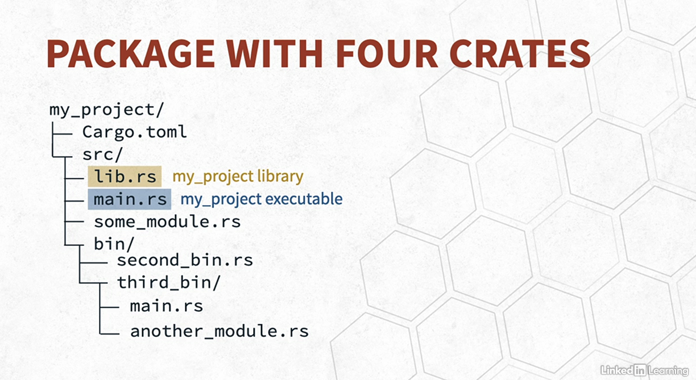

# Using Modules to Reuse and Organize Code

As your code grows, you’ll eventually move functionality into other functions for reuse and better organization. By
splitting your code into smaller chunks, each chunk is easier to understand on its own. But what happens if you have too
many functions? Rust has a module system that enables the reuse of code in an organized fashion.

In the same way that you extract lines of code into a function, you can extract functions (and other code, like structs
and enums) into different modules. A module is a namespace that contains definitions of functions or types, and you can
choose whether those definitions are visible outside their module (public) or not (private). Here’s an overview of how
modules work:

* The mod keyword declares a new module. Code within the module appears either immediately following this declaration
  within curly brackets or in another file.
* By default, functions, types, constants, and modules are private. The pub keyword makes an item public and therefore
  visible outside its namespace.
* The use keyword brings modules, or the definitions inside modules, into scope, so it’s easier to refer to them.

## Modules

* Subdivide code to group related items
* Provide isolate namespaces to control scope and privacy
* Can contain Functions, Macros, Types, Traits, impl blocks and even modules

## Paths

* Reference items within the module system
* Can be relative or absolute

## Crates

* Types of crates
    * Binary crate
    * Library crate

## Packages

* Used to build, test, and share crates with Cargo
* Contains one or more target crates
    * Up to one library crate
    * Zero to many binary crates

## Package and Crate

