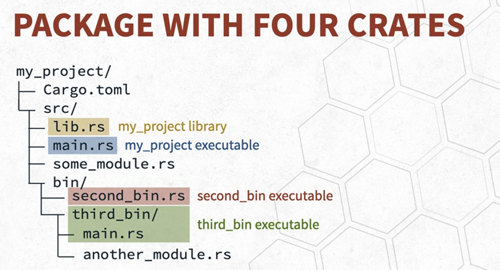
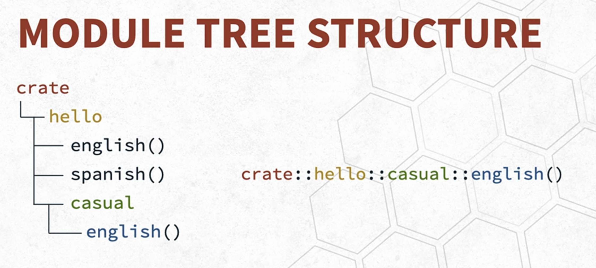
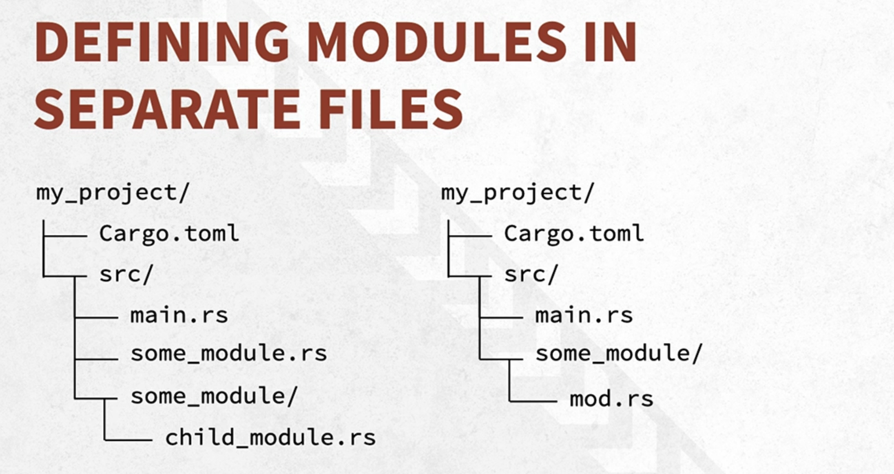

# Rust: Managing Projects

## Modules

* Subdivide code to group related functionalities / items
* Provide isolated namespaces to control scope and privacy
* Modules can contain:
    * Structs
    * Enums
    * Traits
    * Functions
    * Impl blocks
    * Constants
    * Other modules

### Paths

* Reference items with the module system
* Can be relative or absolute

## Crates

* A binary
* library

## Packages

* Used to build, test, and share crates with Cargo
* Contains one or more target crates
    * Up to one library crate
    * Zero or more binary crates
* Consists of a Cargo.toml file and collection of source files
* Can contain multiple crates
* Can contain multiple binaries inside bin directory
* Compile all binaries with `cargo build --all` or 'cargo build --workspace'
* Can compile a specific binary with `cargo build --bin <binary_name>`



**One note:** super keyword: reference parent module

Inline module example:

```rust
fn main() {
    println!("Hello, world!");
}

mod hello {
    fn english() {
        println!("hello");
    }

    fn spanish() {
        println!("hola");
    }

    mod casual {
        fn english() {
            println!("hey");
        }
    }
}
```



## Defining Modules in Separate Directories

* Create a new directory for each module
* Create a new file for each module

